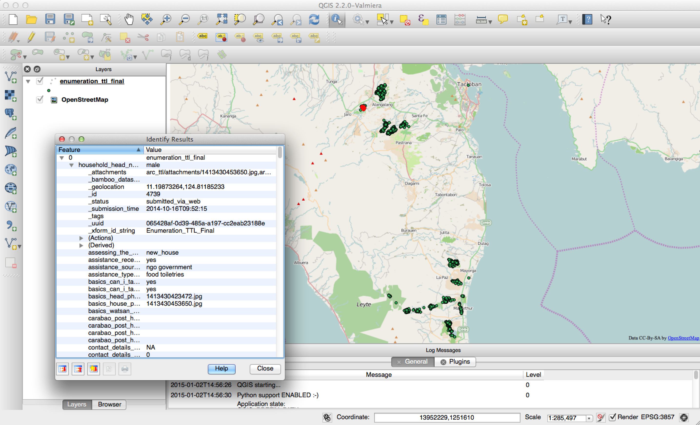
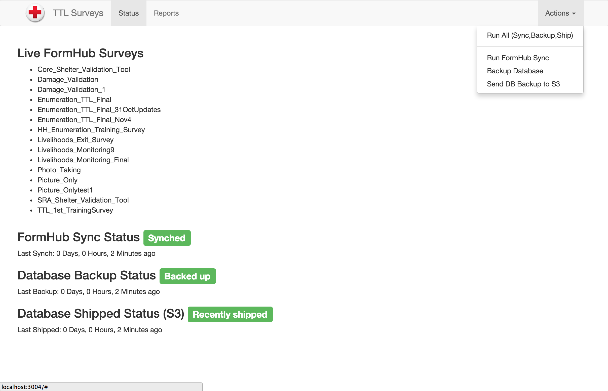

TTL_ETL
=======

A [FormHub](https://formhub.org/) -> PostGres ETL.

This project is a Node.js application (The ETL) plus a lightweight Angular.js client app that controls the 3 main compoents of the ETL:

1. FormHub Sync - Using a FormHub API Token, connects to RedCross Formhub instance, reads all forms, and downloads all data.  Truncates/Creates PostGres tables and inserts data in a flattened way.
2. Database Backup - Uses Node.js to issue a shell command to back up PostGres DB.
3. Ship Backup to S3 - Given S3 credentials and a directory of backups, the Node.js app will find the most recent backup, and send it to the S3 bucket.

Screenshot of Data loaded into QGIS

## Quick(ish) Setup

1. Install Node/NPM
2. Clone this repository
3. Copy settings/settings.js.example and call it settings/settings.js
4. Update the values to include your FormHub API Key, Base URL to your formhub instance, and FormHub port (probably 80)
5. Add your Postgres settings in settings.js (you need to create an empty DB in PostGres that has the PostGIS Extension)
6. run `npm install` (use sudo if necessary) in the root folder to install all of the dependencies
7. Add your Amazon Web Service Credentials: Create a credentials file at ~/.aws/credentials on Mac/Linux or C:\Users\USERNAME\.aws\credentials on Windows
8. Inside of the file from #7, add

    aws_access_key_id = your_access_key

    aws_secret_access_key = your_secret_key

9. run the app: `node index.js`
10. Open http://yourIP:3004 to see the Angular UI.

## Background

This utility is meant to help automate the extraction of tabular/spatial data from a FormHub API Instance and load it into a Postgres database.
Although the FormHub API has an interface that allows for extraction of data into XML and CSV formats, it can become tedious and repetitive if this process needs to be done daily.
This utility can be scheduled to run on a periodic basis to automatically extract data and load it into a postgres DB.

## Components

The 3 main components of the ETL are described in the sections below:

1. [FormHub Sync](#FormHubSync)
2. [DB Backup](#DBBackup)
3. [Ship DB to S3](#ShipToS3)

#### TTL API Endpoint
To run all 3 sequentailly:

    http://localhost:3004/runall

### FormHubSync

TTL API Endpoint to run this individual component:

    http://localhost:3004/etl

This part of the ETL is where most of the work happens.  This piece consists of several sub-components:

1. Connect to FormHub API using an API Token and request a list of all forms (surveys)

    Hits the endpoint: `http://formhub.redcross.org/api/v1/data`

2. For each form listed by this endpoint, download the dataset from formhub:

    Hits the endpoint (for example): `http://formhub.redcross.org/api/v1/data/arc_ttl/140`

3. Interestingly, each 'row' returned for a given dataset may have different properties/column names.  In order to flatten this out and prepare to insert into a database table, we need to iterate over every row and find all unique rows, and add to a single list.
   Also, the formhub column/property names contain forward slashes "/", which tends to mess stuff up.  So, while we're grabbing all of the unique column names, we 'clean them up' by running each name thru a function:

   `common.formatFormHubColumnName()`

   As we found out after starting to do this, simply keeping the last portion of the column name after the last forward slash resulted in duplicate column names.
   For this reason, we decided to take the last 2 sections separated by forward slashes and concatenate them. This has (so far) resulted in uniquely named columns.

4. Next, each survey/form currently in memory is looped over.  For surveys that have columns AND also have data AND don't have the word 'test' in the name, we check to see if a PostGres table exists.
   Note: not every survey that is pulled necessarily has any rows. We skip these.
   We check for existence by trying to `TRUNCATE` (drop all of the rows in) the table in psql.  If an error is returned, it is assumed that the table doesn't exist.  When this happens, a new table is created automatically.

5. Next, we iterate over all of the surveys (again) and try to insert each row in memory into the correct table in the DB.

6. Now that tables are added and data is inserted, we iterate again and check to see if a particular survey/form has a _geolocation property.  If so, we `ALTER TABLE` and add a geometry column, SRID is 4326.

7. We then attempt to add the X,Y coordinates as a geometry in the DB.
   Note: just because a survey has the _geolocation property doesn't mean it has proper values.  Often, the property has null values.

### Note:

*Occasionally, the FormHub API will choke and return a 502 error, which may result in a misfire of the ETL.  Running it again usually does the trick.*

### DBBackup

TTL API Endpoint to run this individual component:

    http://localhost:3004/backup

This component backs up the postgres database defined in settings/settings.js.
The backup file is placed in the /backups folder.
On Linux, we'll schedule this as a nightly job using crontab.

Basically, the single step for this process issues a shell command:

    pg_dump -v ttl backups/ttl.out

This uses pg_dump with the verbose option to back up the ttl database and write it to a file called ttl.out located in the /backups folder.

### ShipToS3

TTL API Endpoint to run this individual component:

    http://localhost:3004/sendtos3

This component reads thru the /backups folder, and looks for files with the extensions of '.out', '.bak' and '.sql'.
If one or more matching files are found, then it checks to see which of those files is the most recent.
It then zips this file and sends it to an Amazon S3 Bucket.

## Angular User Interface

Screenshot of Angular UI

In order to easily see the status of synced files, DB Backups and S3 shipments, a simple Angular.js UI was created.
The UI also allows users to run predefined queries (reports), view them in the UI, and also download the output as a CSV.

To run a particular component, use the 'Actions' dropdown in the top right.
There are 4 options here:

1. Run All - This option runs the FormHub Sync/DB Load, then backs up the DB and ships the backup to S3 sequentially.  At the time of writing, these 3 operations take about 1 to 2 minutes.
2. Run Sync with FormHub (Only) - Fetches data from FormHub and loads it into a PostGres DB.
3. Run DB Backup - Backs up a local PostGres DB.
4. Run 'Ship to S3' - finds the latest backup file and ships it to an Amazon S3 Bucket.

### Status Panel

The default view is the status page.

It lists the latest forms downlaoded from FormHub as well as the status of the 3 main ETL components.
It also displays the last time each of the 3 main components was run. If any of the items is over 3 days old, the color of the badge changes to yellow and then red (depending on how stale the last runs are).

## Reports Panel

The reports panel offers a simple UI to select a pre-designated report to run.
The results appear beneath the dropdown along with a button to download the results to .CSV.

To add/modify the pre-defined reports, see the file located at:

    public/js/settings/reports.js

Note: This file is referenced by both the server side Node.js process AND the client side Angular UI, but lives in the client side folder structure.

## Environment Setup for Development

If you intend to develop/alter this application, note that the Angular.js UI component (located in /public folder) uses [watchify](https://github.com/substack/watchify) and browserify to monitor and compress the client side javascript (also lets you use the 'require' style of javascript references).
Watchify and Browserify should be already installed when `npm install` is run in the root folder (if you followed the Quick Setup steps at the top of this document).

To actually start watching for code changes to automatically trigger the browserify build, in terminal type:

    npm run-script watch

This will watch for .js file changes in the public folder and automatically build the output .javascript file: /public/lib/ttl_client.js which is referenced by index.html.

